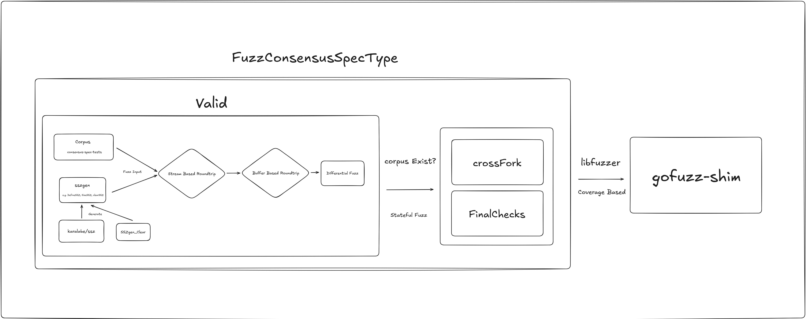

## SSZ Fuzzer  

This project performs fuzzing on [karalabe/ssz](https://github.com/karalabe/ssz) based on Ethereum 2.0 Consensus Spec tests.  

---

### Overview  

- **Corpus Collection**  
  - Collects valid SSZ samples from multiple fork consensus spec test files.  
- **Coverage-Guided Fuzzing**  
  - Uses `gofuzz-shim` and builds with `libFuzzer` for coverage-based fuzzing.  
- **Differential Testing**  
  - Differential fuzzing is performed by bridging [karalabe/ssz](https://github.com/karalabe/ssz) to match the [fastssz](https://github.com/ferranbt/fastssz)  structure and comparing their re-encoded outputs. 
- **Cross-Fork Validation**  
  - Ensures proper decoding/encoding of the same SSZ input across different fork settings.  

---

## Architecture Diagram



----

### Getting Started  

#### Prerequisites  
- Go 1.18 or later (to use Go's built-in fuzzing functionality)  
- Standard Go development environment  

#### Installation  

```sh
git clone https://github.com/KindKillerwhale/sszfuzzer.git
cd sszfuzzer
```

#### Build & Run

Execute the `oss-fuzz.sh` script to build each SSZ object using gofuzz-shim and libFuzzer:

```sh
./oss-fuzz.sh
```

Once built, the binary can be executed to start fuzzing.

----

## Contributing

Contributions are always welcome!
Feel free to create an issue or submit a pull request.

